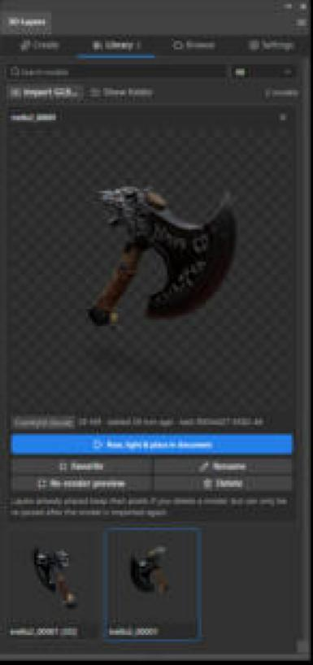
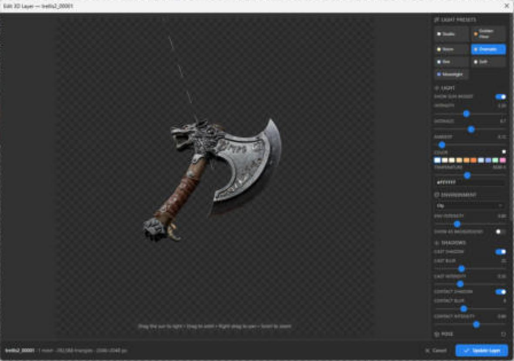
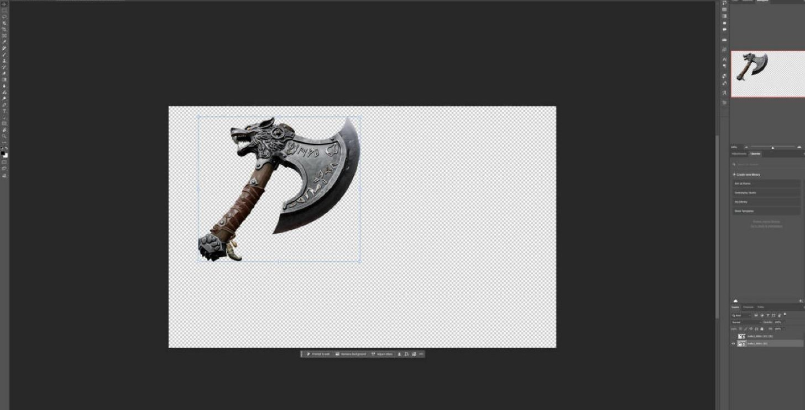

# Geekatplay 3D Layers — 3D models as re-posable Photoshop layers

A Photoshop plugin that turns a layer or selection into a 3D model with **Meshy**, **Tripo**, **Hitem3D (hi3d.ai)** or your own **ComfyUI** (TRELLIS.2 built in, or any image→3D workflow). It keeps every model in a local library, and places a posed, lit render into your document as a smart-object layer. **Double-click that layer** to reopen the 3D editor, change the pose or lighting, click **Update Layer**, and the layer updates in place. Your position, scale and layer effects are kept.

The 3D editor is the ImageExpress *3D View Editor* (sun widget, light presets, shadows, environments, camera views), ported into Photoshop.

| Library panel | 3D pose & light editor | Result: a 3D layer |
|---|---|---|
|  |  |  |

## What it does

1. **Send to 3D:** sends the active layer, or the visible pixels inside a selection, to a 3D service. Transparency is kept, so a cut-out object gives the cleanest model. Jobs run in the background and survive closing the panel or restarting Photoshop.
2. **Browse your collections:**
   - **Meshy:** your image-, multi-image- and text-to-3D tasks.
   - **Tripo:** your account history.
   - **ComfyUI:** its job history.
   - **Hitem3D:** the tasks this plugin sent, since Hitem3D has no list API. You can also track any task ID started elsewhere.

   Import any model with one click.
3. **Local library:** models are downloaded once into a folder on your computer, so they open instantly and keep working after the service's download links expire. Previews are rendered automatically for models that arrive without one.
4. **Previews:** every library card has a thumbnail. Select a card for an interactive 3D turntable.
5. **Pose, light, place, re-pose:**
   - **Pose and light:** turn, tilt, roll and scale the model; set the camera views and field of view; drag the sun; use the light presets, color temperature, environments and cast/contact shadows.
   - **Resolution:** export at up to 8192 px, or match the document.
   - **Placement:** the render becomes a smart object and stores its pose and lighting in the layer's metadata, inside the PSD. Double-click it any time to edit it again.
6. **Settings:** API keys, server addresses and per-service generation options, each with a **Test connection** button that also shows your balance.
7. **Updates:** checks GitHub releases (every 12 h, or on demand) and offers the update in the panel. **Update** downloads it, verifies its SHA-256, and hands it to Creative Cloud's installer.

## Install (one click)

Requirements: Photoshop 2025 (v26) or newer with the Creative Cloud desktop app, on Windows or macOS.

- **Windows:** download [`install-windows.cmd` and `install-windows.ps1`](https://github.com/GeekatplayStudio/Photoshop-3D/releases/latest) into the same folder and double-click `install-windows.cmd`. Or paste this into PowerShell:
  ```powershell
  irm https://raw.githubusercontent.com/GeekatplayStudio/Photoshop-3D/main/install/install-windows.ps1 | iex
  ```
- **macOS:** in Terminal:
  ```bash
  curl -fsSL https://raw.githubusercontent.com/GeekatplayStudio/Photoshop-3D/main/install/install-macos.command | bash
  ```
- **Any OS:** double-click the `.ccx` from the [latest release](https://github.com/GeekatplayStudio/Photoshop-3D/releases/latest), and Creative Cloud installs it.

The installers print every step:

1. Find Adobe's installer.
2. Download the latest release and verify its SHA-256.
3. Remove the old copy.
4. Install the new one and confirm Photoshop has it registered.

Photoshop does not need to restart. Then open **Plugins › Geekatplay 3D Layers › 3D Layers**.

Full walkthrough: **[docs/USER_GUIDE.md](docs/USER_GUIDE.md)**.

## Where your data is

| What | Where |
|---|---|
| Models, previews, settings, job history, log | `%APPDATA%\Geekatplay\3D Layers` (Windows), `~/Library/Application Support/Geekatplay/3D Layers` (macOS) |
| API keys | `credentials.json` in the same folder. Only your OS user can read it; keys are never logged or put in `settings.json`. |
| A 3D layer's pose and lighting | The layer's XMP metadata, saved inside your PSD |

This folder is shared by every Photoshop version, and installs, updates and uninstalls never touch it. Adobe's installer erases the plugin's own UXP storage on every update, which is why the plugin doesn't keep anything there (see [docs/ARCHITECTURE.md](docs/ARCHITECTURE.md#platform-findings)).

## Documentation

- [User guide](docs/USER_GUIDE.md): setup of each service, generating, the library, browsing, the editor, re-posing, updates, uninstalling.
- [Troubleshooting](docs/TROUBLESHOOTING.md): installer error codes, connection problems, the log.
- [Services](docs/PROVIDERS.md): exactly which API calls are made to Meshy, Tripo, Hitem3D and ComfyUI, and how to add another service.
- [Architecture](docs/ARCHITECTURE.md): how the plugin is built, and the Photoshop/UXP behaviours it works around.
- [Development](docs/DEVELOPMENT.md), [Testing](docs/TESTING.md), [Releasing](docs/RELEASING.md).
- [Changelog](CHANGELOG.md).

## Development quick start

```bash
npm install
npm run dev:web        # the UI in a browser against a mock Photoshop (http://localhost:5173/panel.html)
npm test               # unit tests
npm run test:e2e       # browser tests of the panel and the 3D editor
npm run dev:install    # build, package and install into your Photoshop
```

## License

MIT © Geekatplay Studio. Environment maps: Poly Haven via `@pmndrs/assets` (CC0).
