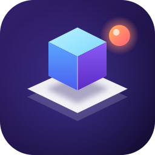
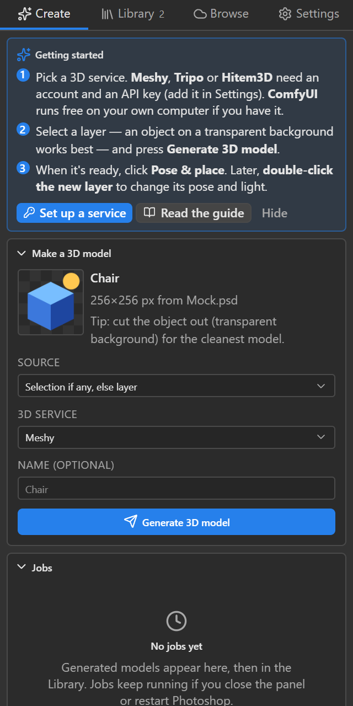
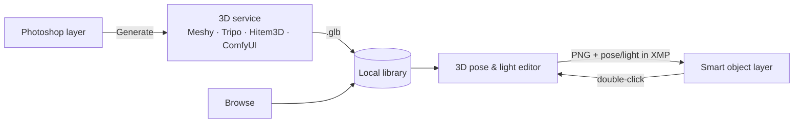

<p align="center">
  
</p>

<h1 align="center">Geekatplay 3D Layers</h1>

<p align="center">
  <b>Turn any Photoshop layer into a 3D model, then pose it and light it as a layer you can change at any time.</b><br>
  Works with Meshy, Tripo, Hitem3D (hi3d.ai) and your own ComfyUI.
</p>

<p align="center">
  <a href="https://github.com/GeekatplayStudio/Photoshop-3D/releases/latest/download/geekatplay-3d-layers.ccx"></a>
</p>

<p align="center">
  <a href="https://github.com/GeekatplayStudio/Photoshop-3D/releases/latest"></a>
  <a href="https://github.com/GeekatplayStudio/Photoshop-3D/actions/workflows/ci.yml"></a>
  
  
  <a href="LICENSE"></a>
</p>


## How it works

1. **Select a layer** in Photoshop, such as an object on a transparent background, and click **Generate 3D model**. A 3D service turns it into a real 3D model.
2. **Pose and light it.** Turn the model, pick a lighting preset, drag the sun, add shadows, and click **Place in Document**. The result is a normal layer.
3. **Change it later.** **Double-click the layer** to reopen the 3D editor. Change the pose or light, click **Update Layer**, and the layer updates in place. Its position, size, masks and effects stay as they were.

Every model is saved in a library on your computer, so you can use it again in any document without paying to generate it twice.

| Create | Your library | Browse your services | Settings |
|:---:|:---:|:---:|:---:|
|  |  |  |  |
| Send a layer or selection to a 3D service and follow its progress. | Every model you made or imported, with previews. Double-click to place. | Load models you made earlier on Meshy, Tripo, Hitem3D or ComfyUI. | Add your keys, test the connection and see your credit balance. |

---

## Install in one minute

You need **Photoshop 2025 or newer** on Windows or macOS. You don't need to close Photoshop.

1. **[Download the plugin](https://github.com/GeekatplayStudio/Photoshop-3D/releases/latest/download/geekatplay-3d-layers.ccx)** (`geekatplay-3d-layers.ccx`).
2. **Double-click the downloaded file.** Creative Cloud warns that the plugin isn't from the Adobe Marketplace. Click **Install**.
3. In Photoshop, open **Plugins › Geekatplay 3D Layers › 3D Layers**.

**Didn't work?** On **Windows**, open **PowerShell** from the Start menu, paste this line and press Enter:

```powershell
irm https://raw.githubusercontent.com/GeekatplayStudio/Photoshop-3D/main/install/install-windows.ps1 | iex
```

On a **Mac**, open **Terminal**, paste this line and press Return:

```bash
curl -fsSL https://raw.githubusercontent.com/GeekatplayStudio/Photoshop-3D/main/install/install-macos.command | bash
```

📖 **[Step-by-step install guide with pictures](docs/INSTALL.md)**, including how to update and uninstall.

**Updates are automatic.** When a new version is out, the panel shows an **Update** button. Click it, click **Allow** when Photoshop asks, and Creative Cloud installs it. Your models, settings and keys are kept.

---

## Your first 3D layer

1. Open the **3D Layers** panel. The first time, a **Getting started** card shows the steps.
2. **Choose a service** in the **Settings** tab and paste its key (see the table below). Click **Test connection** to check it.
3. **Select a layer**, ideally one object on a transparent background, and click **Generate 3D model** in the **Create** tab. Most services take a few minutes. You can keep working while it runs.
4. When the job says **Ready**, click **Pose & place**, set the pose and light, and click **Place in Document**.
5. Later, **double-click the layer** to change it.

The [user guide](docs/USER_GUIDE.md) explains every option.

## Choose a 3D service

You only need one. All of them return a textured model.

| Service | Cost | What you need | Get started |
|---|---|---|---|
| **Meshy** | Uses Meshy credits (API access needs a paid plan) | An API key (`msy_…`) | [meshy.ai → API keys](https://www.meshy.ai/developers/keys) |
| **Tripo** | Uses Tripo credits | An API key (`tsk_…`) | [platform.tripo3d.ai → API keys](https://platform.tripo3d.ai/api-keys) |
| **Hitem3D** (hi3d.ai) | Uses Hitem3D credits | An Access Key and Secret Key | [hitem3d.ai](https://www.hitem3d.ai) ([how](https://docs.hi3d.ai/en/api/getting-started/introduction)) |
| **ComfyUI** | Free; runs on your own computer | ComfyUI with TRELLIS.2 and a strong graphics card. About 5 minutes per model on an RTX 3090. | [Setup steps](docs/USER_GUIDE.md#comfyui-local-or-on-your-network) |

Keys are stored only on your computer. They are sent only to the service they belong to.

## Features

- **Send to 3D:** the active layer, or just the part inside your selection. Transparency is kept, so cut-out objects give the cleanest models. Jobs keep running if you close the panel, and they continue after a Photoshop restart.
- **Browse your collections:** see the models you already made on Meshy, Tripo, Hitem3D or ComfyUI and import them with one click.
- **Local library:** every model is downloaded once and stored on your computer, so it opens instantly and keeps working after the service's links expire. Previews are made automatically.
- **3D pose & light editor:**
  - Light presets (Studio, Golden Hour, Noon, Dramatic, Rim, Soft, Moonlight), a sun you can drag, and color temperature.
  - Environments, cast and contact shadows, camera views and field of view.
  - Exports up to 8192 px.
- **Re-posable layers:** the render is a smart object. Its pose and lighting are saved inside your PSD, so you can change them any time, even after closing and reopening the file.
- **Your own ComfyUI workflows:** use the built-in TRELLIS.2 workflow or any image-to-3D workflow you export from ComfyUI.
- **Automatic updates** from this GitHub page. Every download is checked against a published checksum.

## Questions

<details>
<summary><b>Is it free?</b></summary>

Yes. The plugin is free and open source (MIT license). The cloud services (Meshy, Tripo, Hitem3D) charge their own credits for each model. ComfyUI is free if you run it on your own computer.
</details>

<details>
<summary><b>Is it safe to install a plugin that isn't from the Adobe Marketplace?</b></summary>

All of the code is on this page. Every release is built from it automatically by GitHub, not on someone's laptop: see the [release workflow](.github/workflows/release.yml). The installer and the in-app updater check each download against its published SHA-256 checksum before installing it. Creative Cloud shows its "not from the Marketplace" warning for every plugin installed this way.
</details>

<details>
<summary><b>What does the plugin send over the internet?</b></summary>

- **The image you choose to send:** only to the service you picked, when you click **Generate**.
- **Requests for your model list and downloads:** to the services you set up.
- **An update check:** to GitHub, at most every 12 hours. You can turn this off in Settings.

There is no tracking or analytics. Every request is written to a log you can read (**Settings › Diagnostics**). Your keys are never logged. [Exactly which calls are made to each service](docs/PROVIDERS.md).
</details>

<details>
<summary><b>Where are my models? Can I use them in other programs?</b></summary>

In a folder on your computer: **Library › Show folder** opens it. Each model is a normal `.glb` file that works in Blender, game engines and most other 3D apps.

- **Windows:** `%APPDATA%\Geekatplay\3D Layers`
- **Mac:** `~/Library/Application Support/Geekatplay/3D Layers`
</details>

<details>
<summary><b>Will updating or reinstalling delete my models or keys?</b></summary>

No. Your library, settings and keys are kept outside the plugin, so installs, updates and uninstalls never touch them.
</details>

<details>
<summary><b>Can I send the PSD to someone who doesn't have the plugin?</b></summary>

Yes. A 3D layer is a normal smart object, so everyone sees the image. To change its pose, the person needs the plugin. The plugin downloads the model again from the service if it can, or asks for the `.glb` file.
</details>

<details>
<summary><b>What kind of image works best?</b></summary>

One object, cut out on a transparent background, evenly lit, seen from the front or at a slight angle. Busy backgrounds, several objects, or very dark images give weaker models.
</details>

<details>
<summary><b>Does it work on a Mac?</b></summary>

Yes. It's the same plugin. Most testing so far has been on Windows 11 with Photoshop 2026, so please [report](https://github.com/GeekatplayStudio/Photoshop-3D/issues) anything that looks wrong on a Mac.
</details>

<details>
<summary><b>Something isn't working</b></summary>

See [Troubleshooting](docs/TROUBLESHOOTING.md). If that doesn't help, [open an issue](https://github.com/GeekatplayStudio/Photoshop-3D/issues) and attach the recent log from **Settings › Diagnostics**. The log never contains your keys.
</details>

## Documentation

| For everyone | For developers |
|---|---|
| [Install guide](docs/INSTALL.md): install, update, uninstall | [Architecture](docs/ARCHITECTURE.md): how it's built, and the Photoshop quirks it works around |
| [User guide](docs/USER_GUIDE.md): every feature and setting | [Services](docs/PROVIDERS.md): every API call, and how to add a service |
| [Troubleshooting](docs/TROUBLESHOOTING.md): error messages and fixes | [Development](docs/DEVELOPMENT.md), [Testing](docs/TESTING.md), [Releasing](docs/RELEASING.md) |
| [What's new](CHANGELOG.md) | |

## For developers

The plugin is a Photoshop UXP plugin. A small host script does all the network, file and Photoshop work, and a web UI (React, React Three Fiber, Tailwind) draws the panel and the 3D editor. Nothing is hidden: every service call is in [`src/host/providers`](src/host/providers) and is logged at runtime.



```bash
npm install
npm run dev:web        # the UI in a browser with a pretend Photoshop: http://localhost:5173/panel.html
npm test               # unit tests
npm run test:e2e       # browser tests of the panel and the 3D editor
npm run dev:install    # build, package and install into your Photoshop
```

See [Development](docs/DEVELOPMENT.md) to get started, and [Releasing](docs/RELEASING.md) to publish a version.

## Credits

- The 3D pose & light editor comes from the *3D View Editor* in Geekatplay **ImageExpress**.
- Built with [three.js](https://threejs.org), [React Three Fiber and drei](https://docs.pmnd.rs), [React](https://react.dev) and [Tailwind CSS](https://tailwindcss.com).
- Environment lighting: [Poly Haven](https://polyhaven.com) HDRIs (CC0) via `@pmndrs/assets`.
- Local generation: Microsoft's [TRELLIS.2](https://github.com/microsoft/TRELLIS.2) through [ComfyUI](https://www.comfy.org).

MIT © Geekatplay Studio. Photoshop and Creative Cloud are trademarks of Adobe. This project is not affiliated with or endorsed by Adobe, Meshy, Tripo, Hitem3D or ComfyUI.
