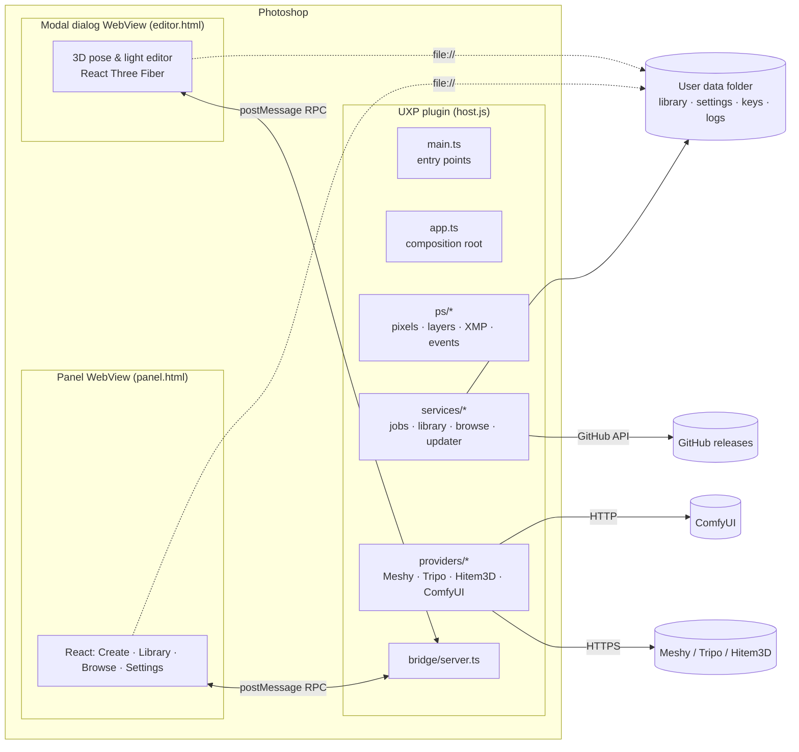

# Architecture

## Overview

The plugin has two halves:

- **The UXP host** (`src/host`, bundled by esbuild into `dist/plugin/host.js`) is the only code that touches Photoshop, the file system and the network.
  - All HTTP goes through it. UXP's `fetch` is not subject to browser CORS, and Tripo's API rejects browser origins.
  - It owns every piece of state: settings, credentials, jobs, the library and history.
- **The WebView UI** (`src/web`, built by Vite into `dist/plugin/web`) is a normal React app running in a real Chromium (WebView2 on Windows, WKWebView on macOS).
  - Photoshop's own UXP UI has no WebGL and limited CSS. The WebView gives the 3D editor WebGL2 and makes the panel easy to build and test in a browser.

They talk over the only channel UXP offers a WebView: `postMessage`. `src/shared/protocol.ts` defines a typed request/response protocol on top of it (`HostApi`), plus push events (`HostEvents`). Both sides compile against the same types.

## Source layout

| Path | Contents |
|---|---|
| `plugin/` | `manifest.json` (version injected at build), the UXP host page `index.html`, icons |
| `src/shared/` | Pure TypeScript used on both sides: protocol, settings schema and validation, layer-XMP codec, 3D presets (from ImageExpress), PNG encoder, SHA-256, semver, UTF-8, placement geometry |
| `src/host/main.ts` | UXP entry points: panel `threeDLayers`, commands `editThreeDLayer` and `checkForUpdates` |
| `src/host/app.ts` | Builds every service and maps each `HostApi` method to them |
| `src/host/ps/` | Every Photoshop call (batchPlay descriptors, `imaging`, `executeAsModal`): read pixels, place/replace smart objects, layer XMP, notifications |
| `src/host/providers/` | One adapter per service, implementing `ProviderAdapter` (`types.ts`); `registry.ts` lists them |
| `src/host/services/` | Job queue, library, browse/import, history, settings, updater, web-asset copy |
| `src/host/platform/` | File store (UXP Entry API), logger, credentials, HTTP helpers, shared-folder paths |
| `src/host/editor/dialog.ts` | The modal dialog that hosts the editor WebView |
| `src/web/panel/` | Panel tabs and state store |
| `src/web/editor/` | The 3D editor (port of ImageExpress `ThreeDLayerEditor`) and its high-resolution capture |
| `src/web/three/` | glTF loading (local Draco/Basis decoders), bundled environments, thumbnail renderer |
| `src/web/bridge/` | Bridge client, plus the mock host used by `npm run dev:web` and the Playwright tests |
| `scripts/` | Build, package (`.ccx`), verify, install into Photoshop, release |
| `install/` | One-click installers for end users |

## Main flows

### Generate
1. `generate.start` → `ps/pixels.ts readSource`:
   - Reads the active layer (`imaging.getPixels` with `layerID`), or the composite inside the selection multiplied by `imaging.getSelection`.
   - Converts to 8-bit sRGB RGBA, scales it down to *max edge*, and encodes a PNG in JS (`shared/png.ts`), because `imaging.encodeImageData` only makes JPEG.
2. `JobManager.start`:
   - Saves the PNG to `jobs/<id>/source.png`.
   - `provider.submit`, then records the task in `history.json`.
3. `JobManager.tick` (every second while jobs are active):
   - Calls `provider.poll` with a backoff from 2 s to 15 s.
   - Retries transient errors (network, 5xx, 429) up to 6 times and fails other 4xx immediately.
4. On success, `importer.ts` downloads the model straight away, because provider links are signed and expire. It checks the format from the bytes (GLB/glTF, never ZIP or glTF with external files), downloads the preview best-effort, and calls `Library.add`.

### Place and re-pose
1. `editor.placeModel` opens `EditorDialog`: a UXP `<dialog>` containing a `<webview>` that shows `editor.html`.
2. The page calls `editor.getInit`. It loads the model straight from the library through a `file://` URL, falling back to streaming it through the bridge.
3. **OK** runs `captureView`:
   - Resizes the canvas to the export resolution at pixel ratio 1, hides the sun widget, and renders.
   - Copies the result to a 2D canvas, encodes a PNG, and computes the alpha bounding box.
   - Sends `editor.complete` with the PNG and settings.
4. The host writes the PNG to the temp folder and calls `ps/layers.ts`, all inside one undoable history step (`suspendHistory`):
   - **New layer:** `placeEvent` creates the smart object. `fitFrame` then scales and moves it, reading the placed frame from `smartObjectMore.transform`, so the *object* (not the transparent frame) fits the source area or the middle 60% of the canvas.
   - **Update:** `placedLayerReplaceContents`, then `fitFrame` restores the previous frame corners, so position and size survive a resolution change.
   - Either way, the layer's `XMPMetadataAsUTF8` gets a `<ps3d:state>` JSON with the library id, model name, provider task id and all `ThreeDSettings` (`shared/xmp.ts`).
5. Double-click interception:
   - Photoshop fires `placedLayerEditContents {documentID, layerID}` right after opening the smart object's contents as a document.
   - If that layer has our XMP, the host closes the document it just opened (named after the embedded file, e.g. `axe-3d.png`) and opens the editor in update mode.

### Update
1. `Updater.check` reads `GET https://api.github.com/repos/<repo>/releases/latest` (or the release list when pre-releases are on) and compares semver tags.
2. `Updater.install`:
   - Downloads the `.ccx` and checks it against `SHA256SUMS.txt` from the same release (`shared/sha256.ts`).
   - Saves it to the plugin temp folder and calls `shell.openPath`, which hands it to Creative Cloud's installer (`UnifiedPluginInstallerAgent /doubleClick`).
3. The release workflow (`.github/workflows/release.yml`) publishes exactly these assets.

## Data
- **User data:** `%APPDATA%\Geekatplay\3D Layers` or `~/Library/Application Support/Geekatplay/3D Layers` (`platform/sharedFolder.ts`) — the library, settings, credentials, jobs, history and logs.
- **UXP data folder:** only a copy of the web UI (`PluginData/web`, refreshed when the build stamp changes). A WebView can only load pages from `plugin:`, `plugin-data:` or `plugin-temp:`, and a page loaded from the data folder can also read `file://` URLs elsewhere, which is how it reads the library.
- **In the PSD:** each 3D layer's state, in its XMP.

## Platform findings

All verified in Photoshop 27.10 / UXP 9.4.1 / UPIA 8.5 on Windows 11 while building this plugin. The code that depends on each finding links back here.

| Finding | Consequence in the code |
|---|---|
| A `.ccx` is a plain ZIP. A ZIP written by Windows' `tar -a` is rejected by UPIA with **status -204**; one written by `fflate`/`archiver` installs. UDT also refuses to package a PS plugin without icons. | `scripts/ccx.mjs` writes ZIPs with fflate, without directory entries, and validates icons and the manifest. |
| `UPIA /install` of a newer version leaves the old one registered too; `UPIA /remove <name>` removes one copy per call. | Installers remove copies in a loop before installing. |
| **Removing any installed copy deletes the plugin's UXP data folder, including `secureStorage`** (a LevelDB under `PluginsStorage/.../SecureStorage`). The folder is also separate per Photoshop version (`PHSP/26`, `PHSP/27`). | All user data, including API keys, lives in the shared user-data folder. `migrateSecrets` moves keys out of secureStorage once. |
| UXP refuses `addNotificationListener(["all"])`. | `ps/events.ts` lists event names explicitly. |
| Double-clicking a smart object fires `placedLayerEditContents {documentID, layerID}` after the contents opened. A placed PNG opens as `<name>.png`, not `.psb`. | `app.ts` closes whichever new document became active. |
| Layer XMP can be set with batchPlay `set XMPMetadataAsUTF8`. It survives `placedLayerReplaceContents` and is saved in the PSD. | The layer state is stored there. |
| Local WebViews (UXP ≥ 8) run Chromium with WebGL2 and ES modules over `file://`. `localStorage` is not available; IndexedDB is. | The UI keeps no state of its own; the host owns it. |
| A WebView page can `fetch` sibling files of its own folder and absolute `file://` URLs, but not `plugin-data:` URLs. | The library is read from `file://`; there is a bridge fallback (`library.readFile`). |
| A `<webview>` declared in HTML does not paint, while one created from script does. | Both WebViews are created in code. |
| Inside a `<dialog>`, a WebView sized in % renders into a wrong 1921×2112 viewport; it only takes real bounds when its **size changes after the dialog is shown**. The dialog element also wraps its content unless given `width/height: 100%`. | `editor/dialog.ts` starts the WebView at 320×240, sizes the dialog to 100%, and follows the dialog's size in pixels. |
| Native `<select>` popups, `<input type="color">` pickers and `title` tooltips open as separate windows that never paint (empty black boxes). | The UI uses `Dropdown`, `ColorField` and `installTooltips` instead. |
| Photoshop keeps Ctrl/Cmd+V, so paste never reaches inputs in a docked panel's WebView. | A paste button reads the clipboard through the host (`clipboard.readText`). |
| UXP host JavaScript has no `TextEncoder`/`TextDecoder`. | `host/polyfills.ts` and `shared/utf8.ts`. |
| WebView `postMessage` throughput is about 50 MB/s each way (64 MB host→page in 1.3 s). | Base64 renders and fallback model streaming are fine. |
| Messages from WebViews reach the host's `window` `message` event with `event.origin` = the page URL. | `app.ts` routes by origin (`editor.html` vs `panel.html`). |
| Opening a `.ccx` runs `UnifiedPluginInstallerAgent.exe /doubleClick <file>`, which hands it to the Creative Cloud app for confirmation. | The updater uses `shell.openPath`. |
| `shell.openPath(folder)` fails with `Extension "" is not accepted` unless `launchProcess.extensions` lists `""` (a folder has no extension). With it, Photoshop shows its permission prompt, using the second argument as the explanation. | `manifest.json` lists `""`; Show folder, Import folder and the log folder pass a message. |
| The panel WebView can `fetch()` any absolute `file://` path the host gives it (also outside the plugin's folders), so imported files are read without passing through the bridge. | `importModels.ts` reads files directly, and asks the host (`library.readImportFile`, only for files of an active import) if that fails. Textures become `blob:` URLs, so no `file://` image ever reaches a canvas. |
| **Panel icons:** the manifest names `icons/x.png`, and Photoshop loads `x@1x.png` / `x@2x.png` for the scales listed. On Windows, a 1× file named without `@1x` is not found, so a panel collapsed in a dock shows an **empty icon** (it may still look fine on macOS). Panel icons also need `"species": ["chrome"]`. That is the convention in Adobe's own samples. Photoshop reads dock icons at startup, so a fix shows after a restart. | `plugin/icons/*@1x.png` and `*@2x.png`, made by `scripts/make-icons.mjs`. `validateManifest` (scripts/ccx.mjs) refuses to package without the `@Nx` files or the chrome species. |

## Adding a 3D service

1. Create `src/host/providers/<name>.ts` implementing `ProviderAdapter`: `isConfigured`, `test`, `submit`, `poll`, `resolve`, and optionally `list` and `cancel`. `meshy.ts` is a complete example.
2. Add it to `PROVIDERS` in `registry.ts` and its id to `ProviderId`/`PROVIDER_IDS`/`PROVIDER_LABELS` in `shared/types.ts`.
3. Add its settings (and secret keys, if any) to `shared/settings.ts` (type, defaults, `sanitizeSettings`), and a section in `web/panel/SettingsTab.tsx`.
4. Add tests next to the others in `providers.test.ts`, using `scriptedFetch`.
