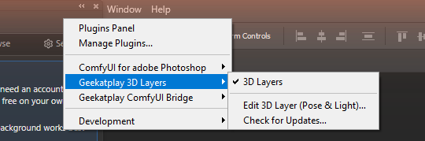
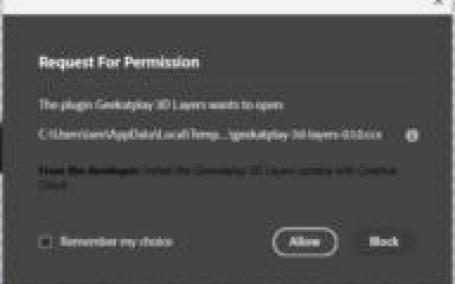

# Install Geekatplay 3D Layers

This takes about one minute. You don't need any technical knowledge, and you don't need to close Photoshop.

## Before you start

You need:

- ✅ **Photoshop 2025 or newer** (Photoshop version 26 or higher). To check: in Photoshop, open **Help › About Photoshop**.
- ✅ **The Creative Cloud app**. You already have it if you installed Photoshop from Adobe.
- ✅ **Windows 10/11 or macOS**, and an internet connection.

---

## Option 1 — Download and double-click (easiest)

**1. Download the plugin.** Click this link:

> ### [⬇ Download Geekatplay 3D Layers](https://github.com/GeekatplayStudio/Photoshop-3D/releases/latest/download/geekatplay-3d-layers.ccx)

Your browser saves a file called `geekatplay-3d-layers.ccx`, usually in your **Downloads** folder. It is always the newest version.

**2. Double-click the downloaded file.** Click it in your browser's download list, or find it in the Downloads folder.

**3. Click Install.** The Creative Cloud app opens and warns that the plugin doesn't come from the Adobe Marketplace. That is expected for plugins you download directly. Click **Install** (some versions say **OK**).

**4. Open it in Photoshop.** In the Photoshop menu bar choose **Plugins › Geekatplay 3D Layers › 3D Layers**.



The **3D Layers** panel opens. You can dock it next to your other panels.

> **Don't see it?** Wait a few seconds and open the Plugins menu again. If it still isn't there, quit and restart Photoshop. If double-clicking did nothing, or Creative Cloud showed an error, use **Option 2**.

---

## Option 2 — Let the installer do it (if Option 1 didn't work)

This runs a small installer from this project. It downloads the newest plugin, checks that the download isn't damaged, and installs it with Adobe's own installer.

### On Windows

1. Click the **Start** button, type **`PowerShell`**, and press **Enter**. A window with a blinking cursor opens.
2. Copy this line. On GitHub, use the copy button that appears at the right of the box:
   ```powershell
   irm https://raw.githubusercontent.com/GeekatplayStudio/Photoshop-3D/main/install/install-windows.ps1 | iex
   ```
3. Click inside the PowerShell window, **right-click** to paste, and press **Enter**.
4. Wait about 10 seconds until you see a green **Installed!** message, then close the window.
5. In Photoshop: **Plugins › Geekatplay 3D Layers › 3D Layers**.

*Prefer a file to double-click?* Download [**install-windows.cmd**](https://github.com/GeekatplayStudio/Photoshop-3D/releases/latest/download/install-windows.cmd) and double-click it. If Windows shows **"Windows protected your PC"**, click **More info › Run anyway**. Windows shows this for any script that isn't from a large publisher.

### On a Mac

1. Press **⌘ Command + Space**, type **`Terminal`**, and press **Return**.
2. Copy this line:
   ```bash
   curl -fsSL https://raw.githubusercontent.com/GeekatplayStudio/Photoshop-3D/main/install/install-macos.command | bash
   ```
3. Click in the Terminal window, paste with **⌘ Command + V**, and press **Return**.
4. Wait until you see **Installed**, then close Terminal.
5. In Photoshop: **Plugins › Geekatplay 3D Layers › 3D Layers**.

### What the installer does

It prints every step as it goes:

1. Finds Adobe's plugin installer, which comes with the Creative Cloud app.
2. Downloads the newest release from this GitHub page and checks it against the published SHA-256 checksum.
3. Removes an older copy of the plugin, if there is one.
4. Installs the new one and confirms Photoshop sees it.

It never touches your models, settings or API keys. You can read the installer itself: [Windows](../install/install-windows.ps1), [Mac](../install/install-macos.command).

---

## It worked — what now?

The first time, the panel shows a **Getting started** card:


1. **Pick a 3D service** and add its key in the **Settings** tab. The [user guide](USER_GUIDE.md#2-set-up-your-services) shows where to get each key. If you run ComfyUI on your computer, no key is needed.
2. **Select a layer** in Photoshop, ideally an object on a transparent background, and click **Generate 3D model**.
3. When the job says **Ready**, click **Pose & place**. Later, **double-click the new layer** to change its pose and light.

---

## Updating

You don't have to do anything special. When a new version is out, the panel shows a blue **Update available** bar:

1. Click **Update**.
2. Photoshop asks: *"The plugin Geekatplay 3D Layers wants to open … .ccx"*. Click **Allow**.

   
3. Creative Cloud asks to install it. Click **Install**.

Your models, settings and keys stay as they are. You can also update any time by repeating Option 1 or Option 2.

## Uninstalling

- **Windows:** download [**uninstall-windows.cmd**](https://github.com/GeekatplayStudio/Photoshop-3D/releases/latest/download/uninstall-windows.cmd) and double-click it.
- **Mac:** in Terminal, run:
  ```bash
  curl -fsSL https://raw.githubusercontent.com/GeekatplayStudio/Photoshop-3D/main/install/install-macos.command | bash -s -- --uninstall
  ```
- Or open the **Creative Cloud app**, go to its list of installed plugins (**Manage plugins**), find **Geekatplay 3D Layers**, and choose **Uninstall** from its **…** menu.

Your models, settings and keys are kept in case you reinstall. To delete them as well, delete this folder:

- **Windows:** `%APPDATA%\Geekatplay\3D Layers`
- **Mac:** `~/Library/Application Support/Geekatplay/3D Layers`

---

## Something went wrong?

| What you see | What to do |
|---|---|
| Double-clicking the `.ccx` does nothing, or opens a different app | Use **Option 2**. |
| *No compatible Photoshop found*, or **status -411** | Update Photoshop to 2025 or newer in the Creative Cloud app, open Photoshop once, then try again. |
| *Not a valid plugin*, or **status -204** | The download was cut short. Download it again. |
| *Adobe's plugin installer was not found* | Open the Creative Cloud app once (update it if it asks), then run the installer again. |
| *Could not reach GitHub* | Check your internet connection and try again. |
| Not in the Plugins menu after installing | Restart Photoshop. |
| Anything else | See [Troubleshooting](TROUBLESHOOTING.md) or [ask for help](https://github.com/GeekatplayStudio/Photoshop-3D/issues). Copy the text from the installer window into your message. |
