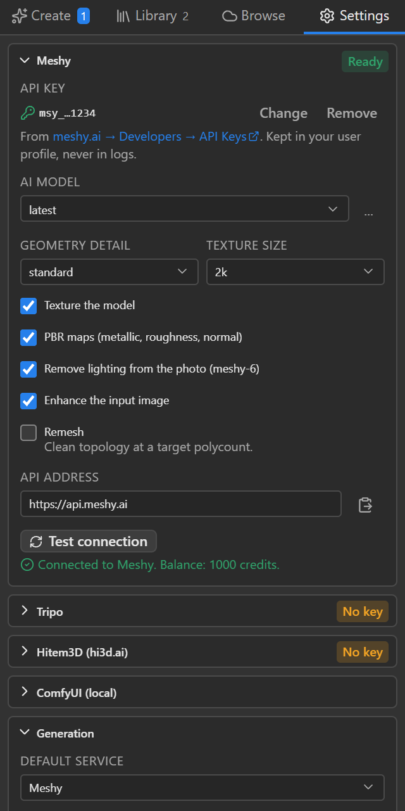
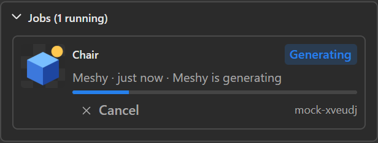
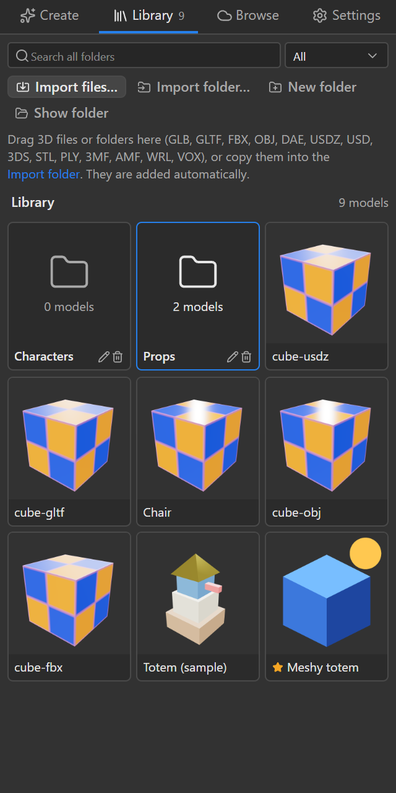
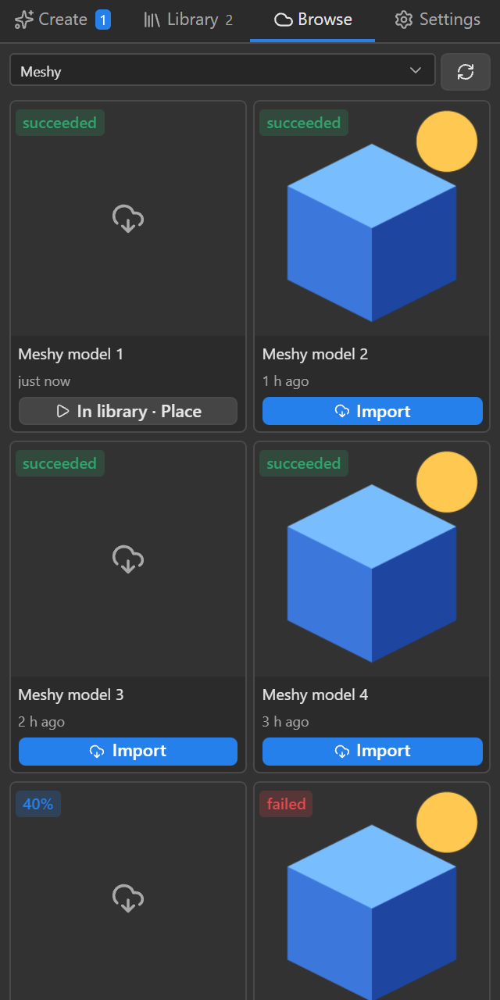
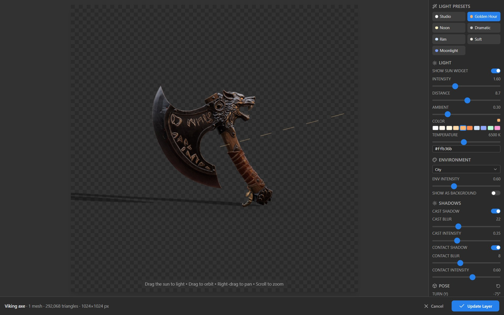

# User guide

## 1. Install

You need Photoshop 2025 (version 26) or newer and the Creative Cloud desktop app, which comes with Photoshop and provides Adobe's plugin installer. **[The install guide](INSTALL.md)** walks through every step with pictures. In short:

| Way | How |
|---|---|
| Double-click (easiest) | [Download `geekatplay-3d-layers.ccx`](https://github.com/GeekatplayStudio/Photoshop-3D/releases/latest/download/geekatplay-3d-layers.ccx), double-click it, and click **Install** when Creative Cloud asks. |
| Windows installer | In PowerShell: `irm https://raw.githubusercontent.com/GeekatplayStudio/Photoshop-3D/main/install/install-windows.ps1 \| iex`. Or download [`install-windows.cmd`](https://github.com/GeekatplayStudio/Photoshop-3D/releases/latest/download/install-windows.cmd) and double-click it; it works on its own. |
| macOS installer | In Terminal: `curl -fsSL https://raw.githubusercontent.com/GeekatplayStudio/Photoshop-3D/main/install/install-macos.command \| bash` |

The installers print each step: find Adobe's installer → download the release → verify its SHA-256 checksum → remove the previous copy → install → confirm Photoshop registered it. If something fails, they say what went wrong and what to do. Photoshop can stay open. To install a specific file instead, run `install-windows.ps1 -Ccx <file.ccx>` or `bash install-macos.command <file.ccx>`; to install a specific version, `-Version v0.1.0` or `--version=v0.1.0`.

Open the panel with **Plugins › Geekatplay 3D Layers › 3D Layers**. The same menu also has **Edit 3D Layer (Pose & Light)…** and **Check for Updates…**.

The first time, the **Create** tab shows a **Getting started** card (pick a service, generate from a layer, place and re-pose) with buttons to open Settings or this guide. **Hide** removes it for good.

## 2. Set up your services

Open the panel's **Settings** tab. Each service has a section with its options and a **Test connection** button, which confirms the key or address works and shows your balance.

API keys can be typed or pasted with the clipboard button next to the field. Ctrl/Cmd+V does not work inside docked panels because Photoshop keeps that shortcut for itself. Keys are saved in `credentials.json` in your user-data folder (see section 10). They are never written to the log or to `settings.json`, and they survive updates.

### Meshy
- **API key:** from [meshy.ai → Developers → API Keys](https://www.meshy.ai/developers/keys) (`msy_…`). Creating tasks through the API requires a paid Meshy plan.
- **AI model:** `latest` (currently Meshy 7.1), `meshy-7.1`, `meshy-6`, `meshy-6-lite`, or `meshy-t2` (**Smart Topology**: a clean low-poly mesh of 100–15,000 faces). Use **…** to type any other model id. If your settings name a model Meshy has retired (for example `meshy-5` or `meshy-7`), the plugin switches to its successor.
- **Geometry detail:** standard / 2k / 4k (2k and 4k need meshy-7.1 or latest).
- **Texture size:** 2k / 4k / 8k.
- **Other options:** PBR maps, remove lighting (meshy-6), image enhancement, and remesh (topology and target polycount). With Smart Topology, only texturing, PBR and the target polycount apply.
- **Previews:** Meshy renders a transparent preview, which the library uses.
- **Download deadline:** Meshy keeps generated files for **3 days**. The plugin downloads them as soon as a job finishes, but use **Browse** to import older Meshy tasks before they expire.

### Tripo
- **API key:** from [platform.tripo3d.ai → API keys](https://platform.tripo3d.ai/api-keys) (`tsk_…`). The plugin uses Tripo's **API v3**; Tripo shuts down API v2 on 2026-11-01.
- **Model version:** `v3.1-20260211` (default, Tripo's latest), `v3.0-20250812`, `v2.5-20250123`, and the low-poly P series `P1-20260311` and `P2-20260801` (preview).
- **Texture model:** Tripo's default, or `v3.5-20260815` (newest; adds **Fast** texture quality and **Remove lighting from the photo**), `v3.0-20250812`, `v2.5-20250123`.
- **Other options:** texture and geometry quality, PBR, smart low-poly, face limit, real-world size, orientation. Options a model doesn't support are hidden. The face limit is kept within the model's range: up to 1.5 million for v3.1 (2 million with detailed geometry), 500,000 for v2.5, 20,000 for P1 and 50,000 for P2.
- **Image size:** Tripo accepts images up to 20 MB.

### Hitem3D (hi3d.ai)
- **Credentials:** an **Access Key** and **Secret Key** that you create at [platform.hi3d.ai → API Keys](https://platform.hi3d.ai/console/apiKey) ([how](https://docs.hi3d.ai/en/api/getting-started/quickstart)). You can also paste `AK:SK` into the first field, or a bearer token. The plugin signs in and refreshes the token itself. The **App ID** is optional.
- **Model and resolution:** `hi3dv3.0` (2048quality/2048master), `hitem3dv2.1`, `hitem3dv2.0`, `hitem3dv1.5`, or the portrait models. The resolution list follows the chosen model.
- **Other options:** geometry + texture or geometry only, face count (0 = Hitem3D default), PBR, Hitem3D-side background removal, and **Remove lighting from the photo** (de-shading strength 0–1, default 0.5; v2.0, v2.1 and v3.0 models).
- **Image size:** Hitem3D accepts images up to 20 MB. Error codes are explained in plain language (for example "the face count is outside the range Hitem3D accepts").
- **Download deadline:** Hitem3D links expire after **1 hour**; the plugin downloads results immediately.

### ComfyUI (local or on your network)
- **Server address:** for example `http://127.0.0.1:8188`, or another machine's IP if ComfyUI was started with `--listen`.
- **Workflow:**
  - **TRELLIS.2 (built in):** needs ComfyUI 0.34 or newer, with the native TRELLIS.2 nodes, and these model files:
    - `trellis_2_int8_convrot.safetensors` (diffusion_models)
    - `trellis_2_shape_vae_bf16.safetensors` and `trellis_2_texture_vae_bf16.safetensors` (vae)
    - `dino_v3_L_naf_fp32.safetensors` (clip_vision)
    - `birefnet.safetensors` (background removal; only needed for images without transparency)

    The easiest way to get them is to open ComfyUI's template **"Pixal3D & TRELLIS.2: Image to Model"**, which offers to download them. The plugin also uses these files from a subfolder, or the documented alternatives (`trellis_2_bf16.safetensors`, `dino_v3_vit_l.safetensors`). **Test connection** lists anything missing. A model takes about 4–5 minutes on an RTX 3090.
  - **Object mask:** *Use layer transparency* (default) cuts the object out exactly where your layer is transparent. Opaque images go through BiRefNet background removal. *Always remove background* runs BiRefNet on everything.
  - **Custom workflow:** export your workflow from ComfyUI with **Workflow › Export (API)** and choose the file. It needs a **Load Image** node, which receives the layer, and a node that saves a `.glb` (for example **Save GLB**). If the workflow has several Load Image nodes, pick the right one in Settings.
- **Seed, texture size, max faces, timeout:** apply to the built-in workflow; seed −1 means random.

## 3. Make a 3D model from a layer

1. Select a layer, or make a selection. For best results, cut the object out on a transparent background.
2. **Create** tab → choose the **Source**:
   - *Selection if any, else layer* (default)
   - *Active layer*
   - *Visible pixels in selection* (masked by the selection, so soft edges stay soft)
3. Choose the **3D service** and optionally a name, then click **Generate 3D model**.
4. The job appears under **Jobs** with progress.

   

   You can keep working or close the panel. Jobs resume after a Photoshop restart.
5. When it says **Ready**, the model is in your library. Click **Pose & place** to open the editor; the result is placed over the original layer's area.

Large layers are scaled down before upload (Settings › Generation › Max image size sent, default 2048 px). If a job fails, **Retry** resends the saved image, or downloads fresh links if the service had already finished.

## 4. Library

The **Library** tab shows every model on this computer: generated, imported from Browse, or imported from your own files.

- Click a card to see an interactive 3D preview and its details: service, size, task id, folder.
- Double-click a card, or use **Pose, light & place in document**, to place it in the active document.
- **Favorite**, **Rename**, **Re-render preview**, **Remove**. Removing a model deletes it from this computer. Layers you already placed keep their pixels, but can't be re-posed until the model is imported again.

### Folders

Organise models into folders, and folders inside folders.

**Create and open folders:**
- **New folder** makes a folder inside the one you are looking at.
- Click a folder to open it.
- The path above the grid (*Library › Characters › Robots*) takes you back up.

**Move models:**
- Drag a model onto a folder, or onto a part of the path to move it up.
- Or select models and use **Move to…**.
- Or pick a folder in the model's details.

**Rename or delete a folder:** use the pencil or bin on the folder. Deleting a folder never deletes models: its models and subfolders move up one level.

**Search:** the search box looks in every folder, and shows which folder each result is in.

Folders are part of the library's index, while the model files stay where they are. Moving models is instant and never affects layers you already placed.

### Select and remove several models

- **Ctrl+click** (Cmd+click on a Mac) adds or removes a model from the selection. **Shift+click** selects a range, and **Ctrl/Cmd+A** selects everything shown.
- With several selected, a bar offers **Move to…** and **Remove**. The **Delete** key also removes the selection after asking, and **Esc** clears it.
- Hover over a model and click the bin in its corner to remove just that one (click **Remove?** to confirm).
- **Show folder** opens the library folder in File Explorer / Finder; every model is a normal `.glb` you can use elsewhere. The first time, Photoshop asks: *"The plugin Geekatplay 3D Layers wants to open …\library"*. Click **Allow**.

### Import your own 3D files

There are four ways to add your own models, and each one adds them to the library automatically:

- **Drag and drop:** drag 3D files, or whole folders, from File Explorer / Finder onto the Library tab. Drop a model together with its textures (or the folder that holds them).
  - This needs **Photoshop 2026** or newer; older versions don't pass dropped files to plugin panels.
- **Import files…** opens a file browser. Pick one or more files.
- **Import folder…** adds every 3D file in a folder and its subfolders.
- **The Import folder:** copy files into the library's *Import* folder in File Explorer / Finder (click **Import folder** in the line under the buttons to open it). While the Library tab is open, new files there are added within a few seconds. Files in it are never moved or deleted; each one is imported once, and again if you change it.

**Where imports go:**
- Dropped and picked files go into the library folder you are looking at.
- A dropped or imported folder becomes a library folder of the same name, with its subfolders.
- In the Import folder, a subfolder such as `Import/Characters/robot.fbx` becomes the library folder *Characters*.

| Format | Notes |
|---|---|
| GLB, glTF | Stored as they are. A `.gltf` with separate `.bin` / texture files is packed into one GLB. |
| FBX, OBJ (+ MTL), DAE (Collada), 3DS, USDZ / USD | Converted to GLB with their materials and textures. |
| STL, PLY, 3MF, AMF, VRML (WRL), VOX (MagicaVoxel) | Converted to GLB. STL, 3MF, AMF and VOX are turned upright (they are Z-up). |

**Textures:**
- Keep textures next to the model, or in a subfolder (for example `textures/`). The plugin finds them by name, even when the file points at a folder on another computer (common with FBX).
- Missing textures are listed in the message after the import.
- Every converted model is stored as a self-contained GLB; your original file is not changed.

**Conversion details:** the panel converts files with three.js' loaders and GLTFExporter.
- Phong/Lambert materials become physically based materials.
- Lights and cameras inside the file are dropped (the 3D editor has its own).
- Animations are not kept, because a 3D layer is a still pose.

## 5. Browse your models on each service

**Browse** → pick a service:

- **Meshy:** your image-to-3D, multi-image-to-3D and text-to-3D tasks made with this API key, newest first. Expired tasks (older than 3 days) can't be downloaded.
- **Tripo:** built from your account's usage history, because Tripo has no "list my models" API.
- **Hitem3D:** the tasks this plugin submitted (Hitem3D has no list API). Use **Track a task ID** for a task you started on the website or another computer.
- **ComfyUI:** every job in ComfyUI's history that saved a `.glb`. ComfyUI forgets history when it restarts; older files are in ComfyUI's `output` folder, so import them with **Library › Import GLB…**.

**Import** downloads the model into your library; **In library · Place** places it.

## 6. The 3D pose & light editor

| Area | Controls |
|---|---|
| Viewport | Drag to orbit, right-drag to pan, scroll to zoom. Drag the **sun** to set the light direction. The viewport has the export's aspect ratio, so what you frame is what you get. |
| Light presets | Studio, Golden Hour, Noon, Dramatic, Rim, Soft, Moonlight |
| Light | Sun widget on/off, intensity, distance, ambient, color (swatches, temperature in K, hex) |
| Environment | Studio, city, apartment, dawn, sunset, forest, park, night, lobby, warehouse; intensity; *show as background* (otherwise the background is transparent) |
| Shadows | Cast shadow (blur, intensity) and contact shadow (blur, intensity) |
| Pose | Turn (Y), tilt (X), roll (Z), scale; reset |
| Camera | Front, ¾ left, ¾ right, side, top, reset; field of view |
| Export resolution | Width/height up to 8192 px, presets 512–4096, **Match document** |

**Place in Document** / **Update Layer** renders at the export resolution with a transparent background and closes the editor. **Esc** cancels and **Ctrl/Cmd+Enter** confirms. Lighting you set for a new model is remembered for the next new model (Settings › 3D editor); reopened layers keep their own settings.

## 7. Re-pose a 3D layer later

A placed render is a smart object named `<model> (3D)`. Its pose, lighting, camera and resolution are saved in the layer's XMP metadata inside the PSD.

- **Double-click the layer thumbnail.** Photoshop starts opening the smart object; the plugin closes that again and opens the 3D editor with the saved settings. Turn this off in Settings › 3D editor if you want to edit the smart object's pixels instead.
- Or select the layer and use the panel's **Edit pose & light** banner, or **Plugins › Geekatplay 3D Layers › Edit 3D Layer (Pose & Light)…**.

**Update Layer** replaces the smart object's contents. The layer keeps its position, scale, rotation, masks, effects, blend mode and name, even if you change the export resolution. Undo it in one step with Ctrl/Cmd+Z ("Update 3D Layer").

If you open the PSD on a computer that doesn't have the model, the plugin downloads it again from the service (for Meshy, only within its 3-day window). Otherwise it asks you to import the GLB.

The **detach** button (broken-chain icon) in the panel's 3D-layer banner removes the 3D data, and the layer becomes an ordinary smart object. If you rasterize a 3D layer, it can still be re-posed; the update is then placed as a new smart object on top of it.

## 8. Updates

The plugin checks the GitHub releases of `GeekatplayStudio/Photoshop-3D` when Photoshop starts, at most every 12 hours (Settings › Updates). When a newer version exists, a banner appears with **Update**:
1. The plugin downloads `geekatplay-3d-layers-<version>.ccx` and checks it against the release's `SHA256SUMS.txt`.
2. It asks Photoshop to open the file with Creative Cloud's installer. Photoshop shows **Request For Permission: The plugin Geekatplay 3D Layers wants to open …ccx**. Click **Allow**. If you click **Block**, nothing is installed; click **Update** again to get the question back.
3. Creative Cloud asks you to confirm the install. Click **Install**.
4. Photoshop reloads the plugin. Your library, settings and keys are kept.

You can also check manually (**Check now**, or **Plugins › … › Check for Updates…**), skip a version, include pre-releases, or rerun the install script at any time.

## 9. Uninstall

- Windows: double-click [`uninstall-windows.cmd`](https://github.com/GeekatplayStudio/Photoshop-3D/releases/latest/download/uninstall-windows.cmd), or run `install-windows.ps1 -Uninstall`. Add `-RemoveData` to also delete your library and keys.
- macOS: `curl -fsSL https://raw.githubusercontent.com/GeekatplayStudio/Photoshop-3D/main/install/install-macos.command | bash -s -- --uninstall`, or `bash uninstall-macos.command`. Add `--remove-data` to delete your data too.
- Or remove it in the Creative Cloud app's list of installed plugins (**Manage plugins**).

## 10. Files the plugin uses

| Path (in the user-data folder) | Contents |
|---|---|
| `library/index.json` | The library list |
| `library/<id>/model.glb`, `thumb.png`, `source.png`, `info.json` | Each model, its preview, the image that generated it, and its metadata |
| `settings.json` | Your settings (no keys) |
| `credentials.json` | API keys |
| `jobs.json`, `jobs/<id>/source.png` | Running and recent jobs (images are deleted when a job finishes) |
| `history.json` | Every task submitted (provider, task id, time) |
| `logs/photoshop3d.log` | Everything the plugin did: requests (without keys), jobs, Photoshop operations, errors |

The user-data folder is `%APPDATA%\Geekatplay\3D Layers` on Windows and `~/Library/Application Support/Geekatplay/3D Layers` on macOS. **Settings › Diagnostics** shows these paths, versions and the recent log.
